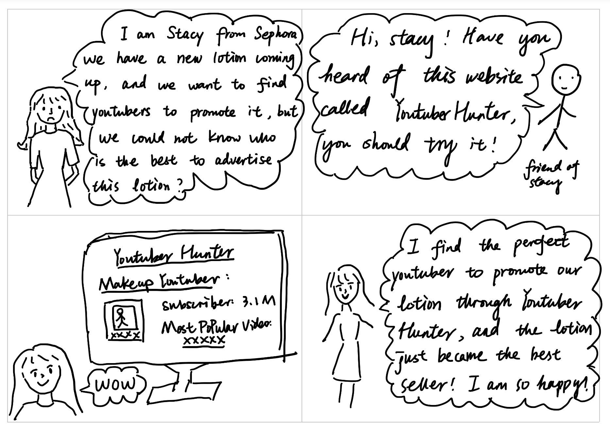
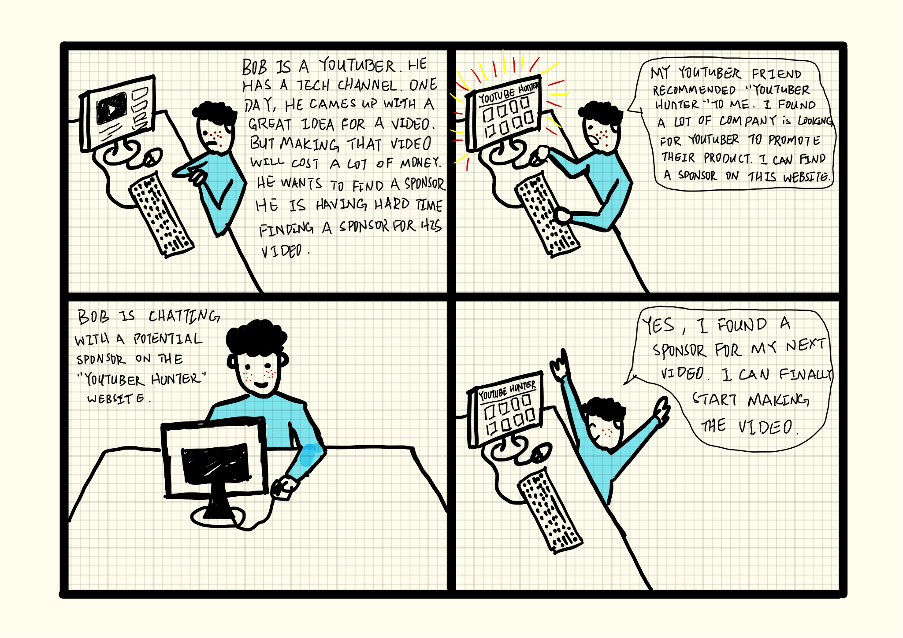
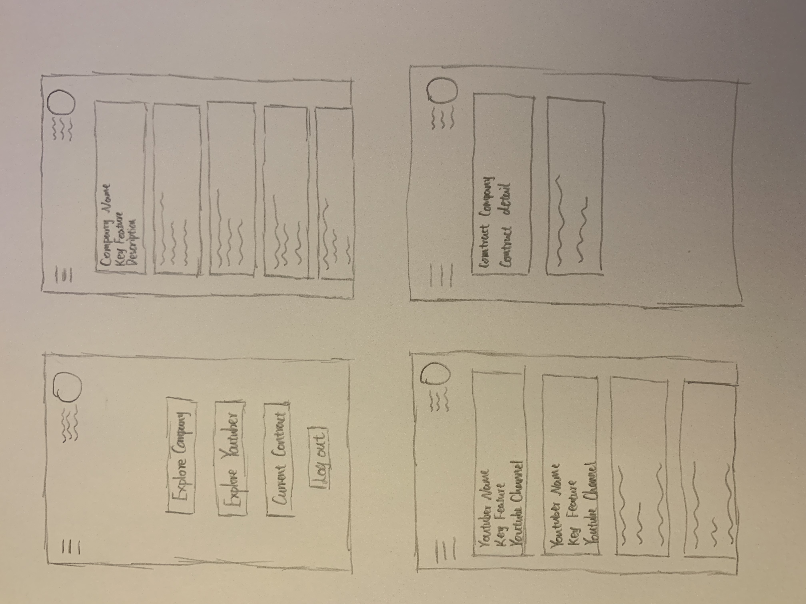
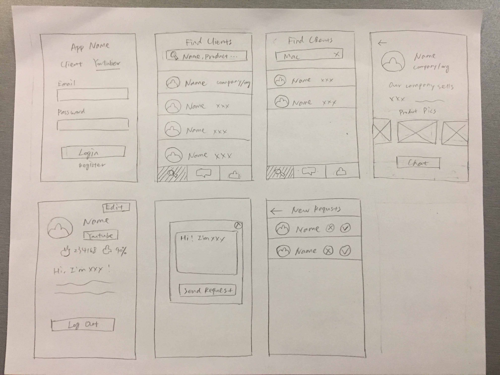
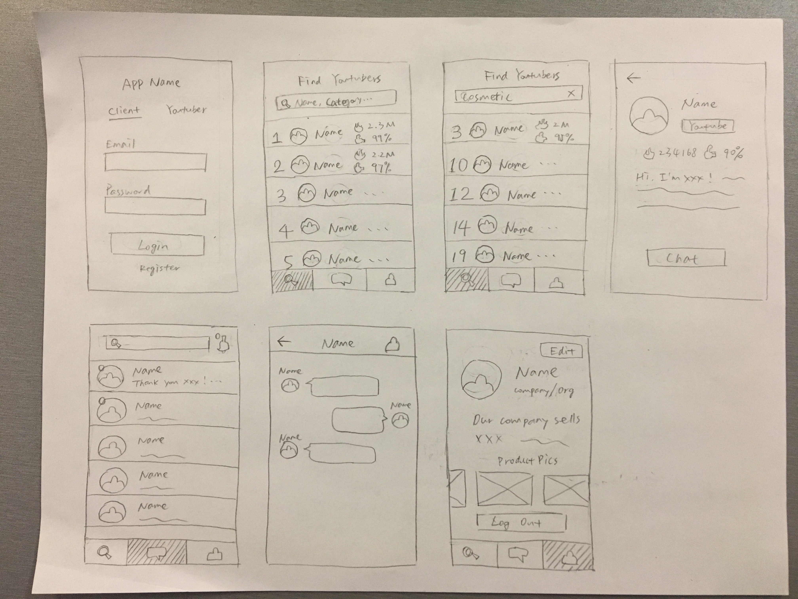

Team Name: Youtuber Hunter

Team Members' Name: Mingshuo Yu, Jiayu Luo, Weilin Liu, Zibin Dong

Project Proposal: 

Nowadays, it is common to see YouTubers advertising products, such as cosmetics and video games, on their videos. This has become a new trend of advertisement. Our project is to create an intermediary for companies and YouTubers, a website for companies to find YouTubers to advertise their products and also for YouTubers to find companies to collaborate. After a YouTuber and a company representative get connected, they can chat on the website and form a contract.

None of our team members are the target users, because none of us are YouTubers or representatives who need to sell products for their companies.

To build this website, we will use YouTubeData API and probably some other APIs as well. Our website provides a list of YouTubers from the most popular one to the least. It also provides information of YouTubers, including their popularity (calculated by the numbers of subscribers and views of their videos), percentage of "thumb up"s they got, topics of their channels, and link to their channels. For YouTubers, our website provides general information about companies and products they sell.

Storyboards:
Storyboard 1:

Storyboard 2:

Paper Prototype 1

Paper Prototype 2

