Team Name: Youtuber Hunter

Team Members' Name: Mingshuo Yu, Jiayu Luo, Weilin Liu, Zibin Dong

Group Proposal: Same as milestone1

Screen Shots:
Screen 1
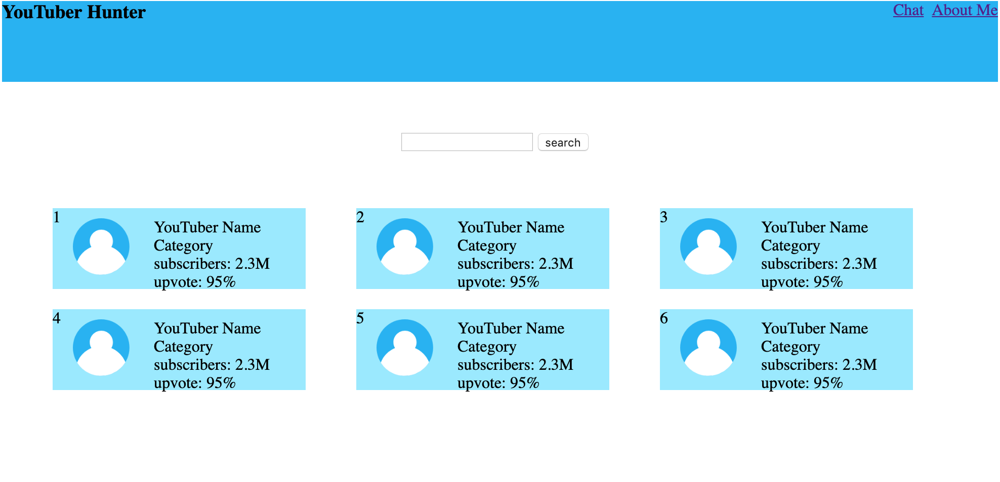
This is the home page for company to look for youtubers. The page shows a list of youtubers.Companys can click on a youtuber to get more information about the youtuber. Companys can also use the search button to search for a youtuber. there are two buttons on the upper right hand corner. One is chat button to open chats. Another one is 'about me' for viewing/editing conpany information.

Screen 2
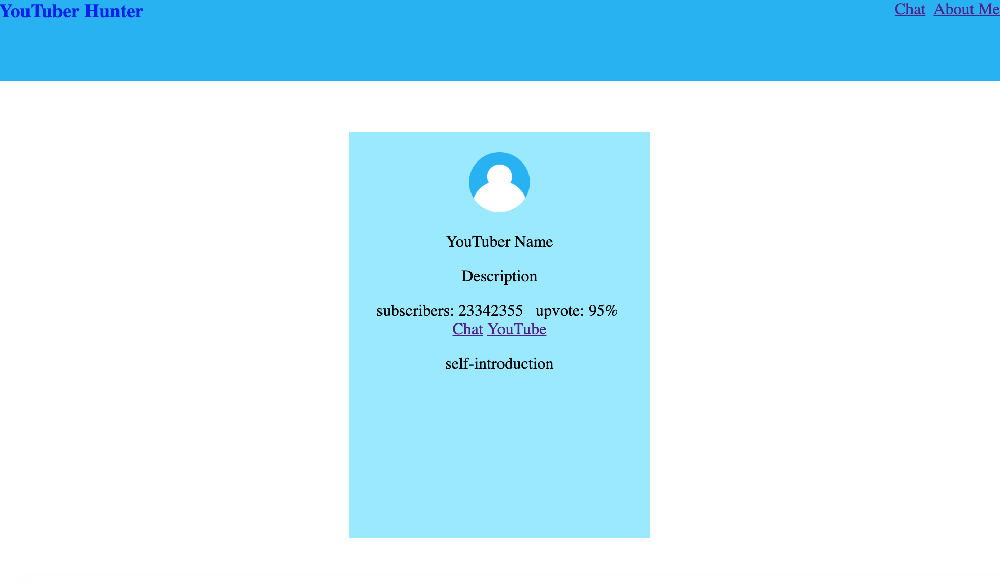
This is the youtuber's detail page after a company clicked on a youtuber. There are two buttons. Companys can click on 'Chat' to open a chat with this particular youtuber. Compant can also click on 'Youtube' to open youtuber's youtube channel.

All remaining screen:
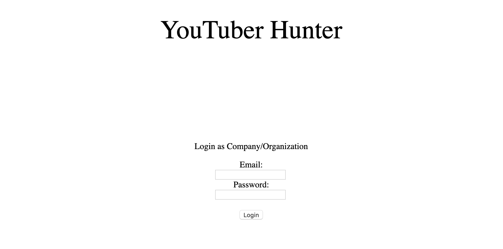
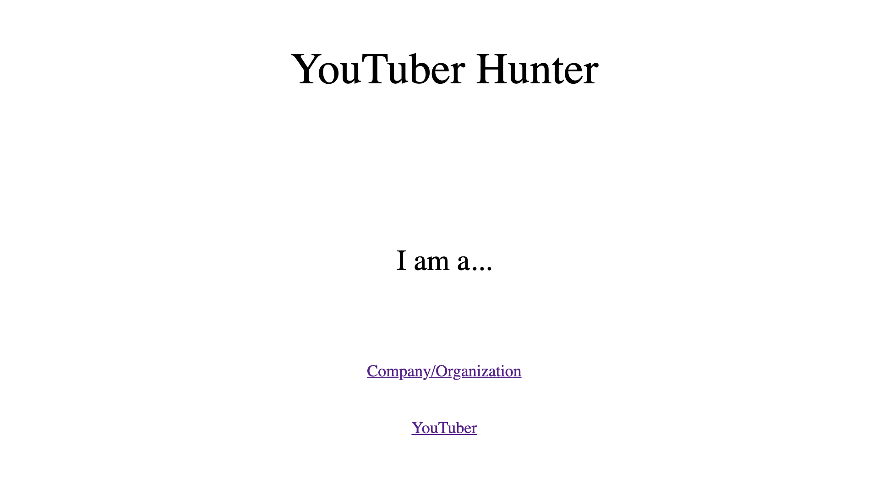
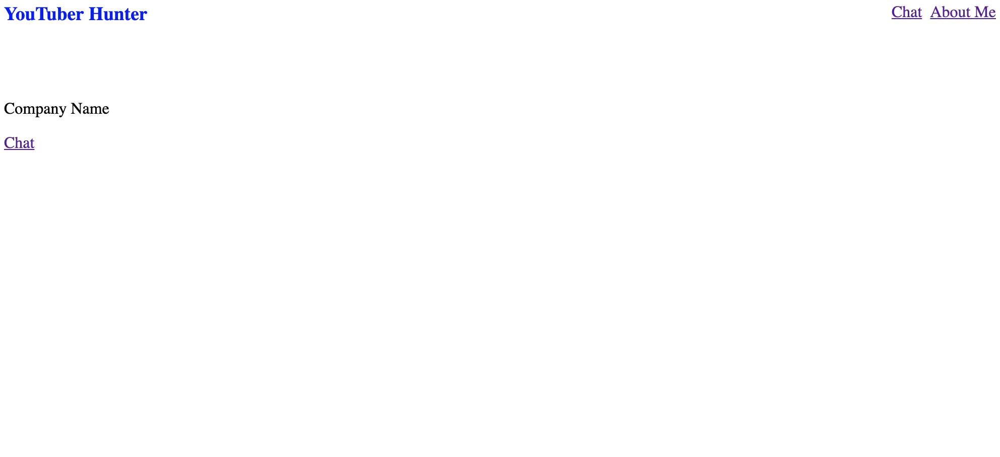
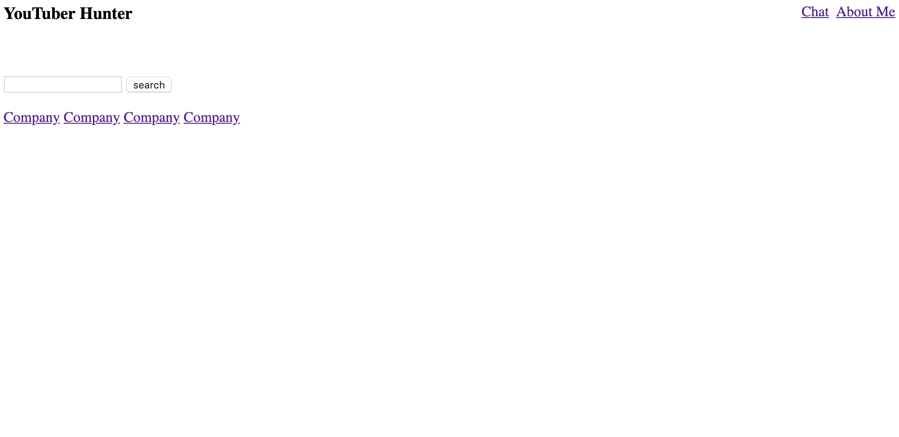
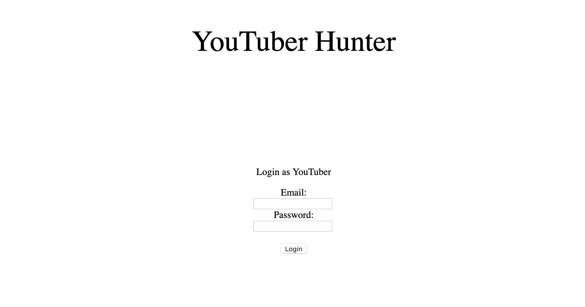
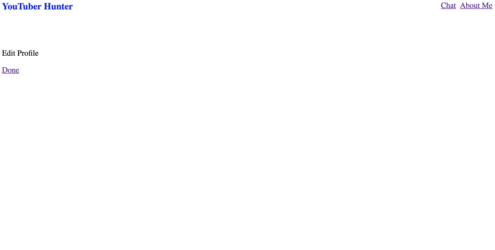
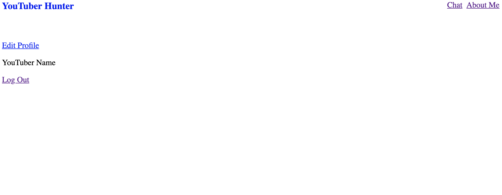
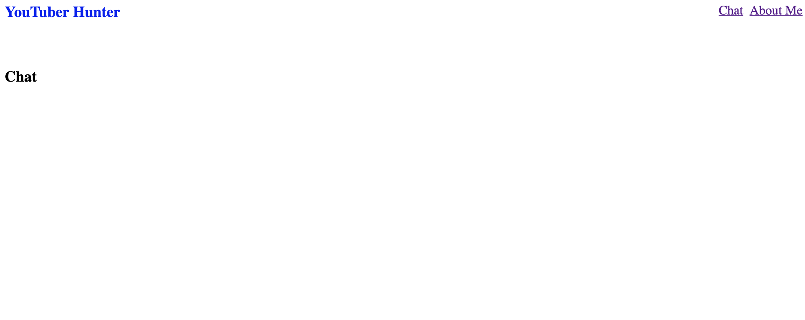
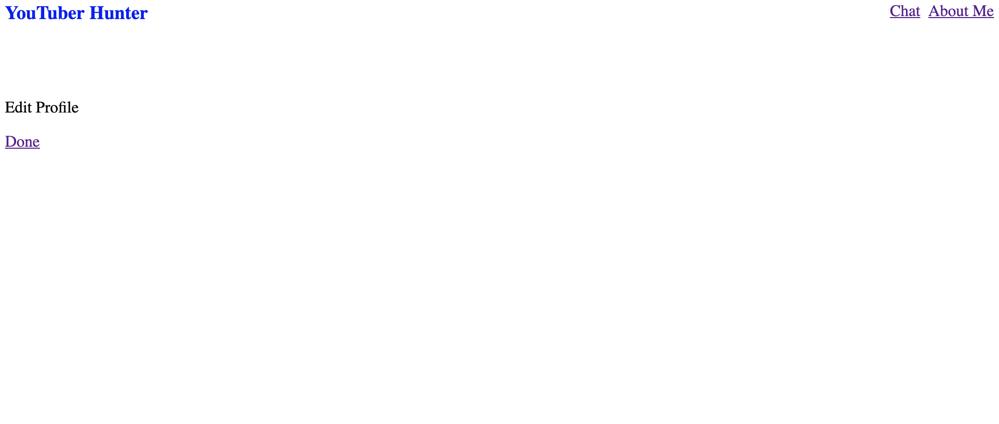
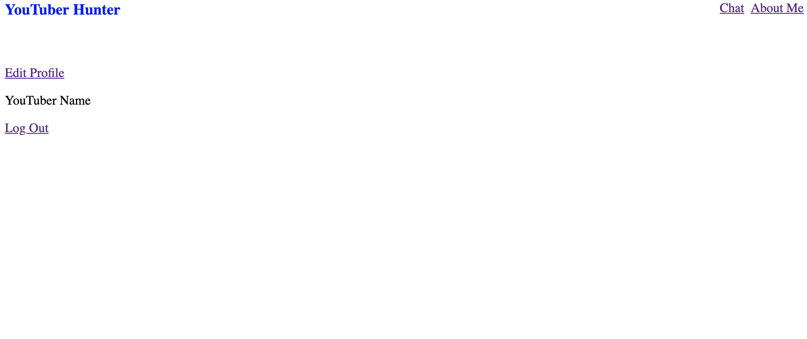
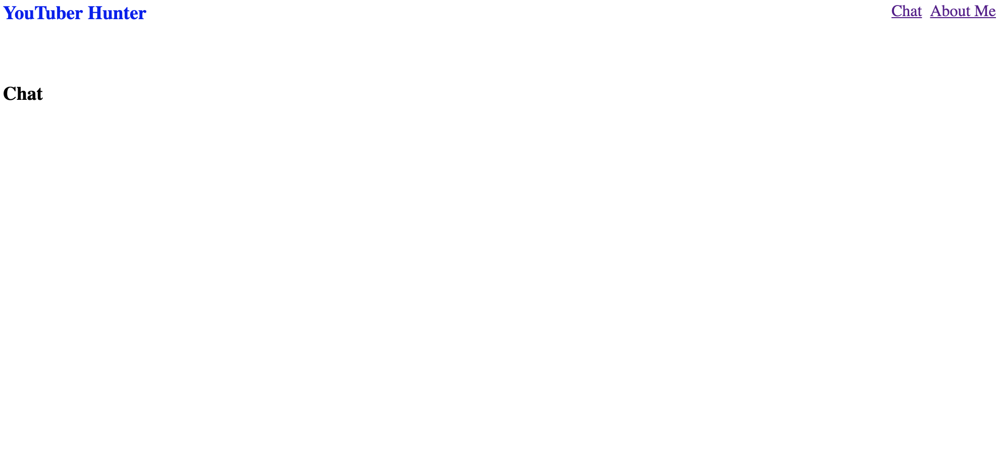

Explanation of difference between screenshots and paper prototypes:

  Compared to the paper prototype in the milestone 1, we made lots of changes. Our design of the frontend relies on the second prototype. The main change is that we changed the page format from mobile version to the PC version. We think there are more people to use the PC version of the app because both businessman or youtuber spend more time on the computer instead of the phone and they need larger space to get more information. The other changes are mostly about the page layout. Due to the page format change, we changed the page layout to fit into our new design.
(Prototype link: https://xd.adobe.com/view/5e7dac0a-90e9-44f7-4e5b-5156a999b4c9-284c/)

